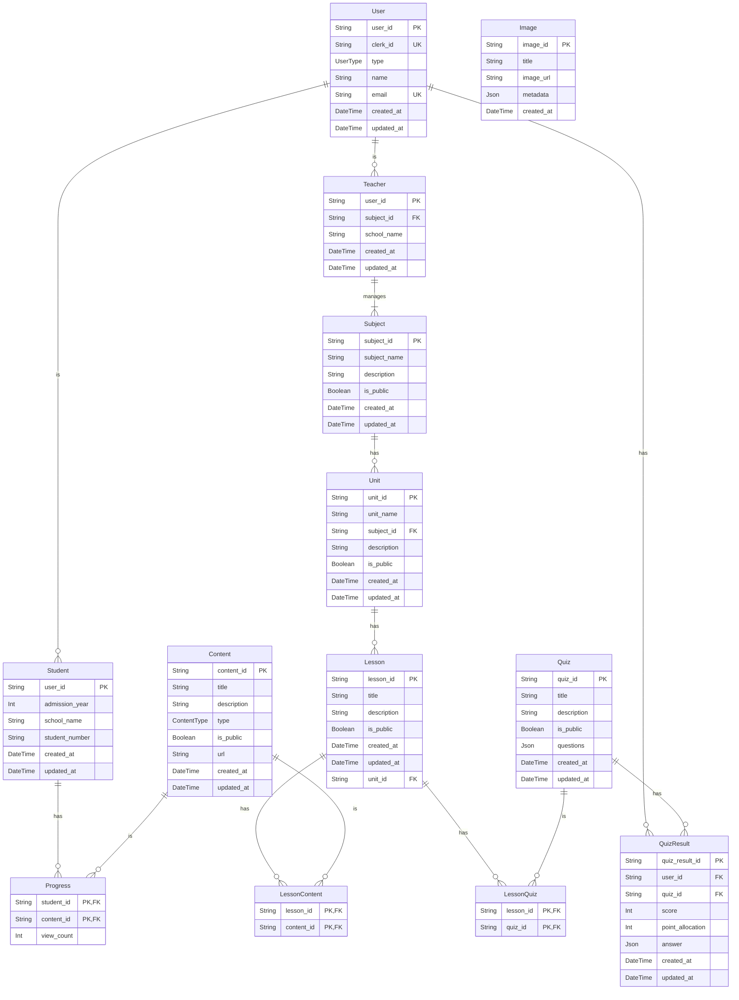

# DESIGN.md

## 1. プロジェクト概要

授業の教材を共有するサイト

## 2. 技術スタック

- **フレームワーク:** Next.js
- **データベース関連:** Prisma (ORM)
- **認証:** Clerk
- **UI/コンポーネント:** Radix UI, Tailwind CSS, shadcn/ui
- **フォーム:** React Hook Form
- **型チェック:** TypeScript

## 3. データモデル

## 4. 主要な機能一覧

- **ユーザー管理 (user)**
    - ユーザー登録・編集・削除
- **教材 (subject, unit, lesson)**
    - 教材の作成・編集・削除
    - 単元、レッスンの管理
- **コンテンツ (content)**
    - 動画、クイズなどのコンテンツ登録・管理
- **レッスンコンテンツ (lessonContent)**
    - レッスンとコンテンツの紐付け
- **クイズ (quiz)**
    - クイズの作成・編集・削除
    - クイズの回答、結果の保存
- **進捗管理 (progress)**
    - 生徒のコンテンツ閲覧状況の管理
- **回答 (answering)**
    - クイズへの回答

# 変更点
- ユーザー登録・認証機能の削除
- UIをフレームワークに置き換えて統一
- コードの可読性、保守性の向上
- パフォーマンス向上